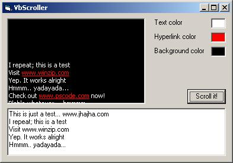



## RTF\-Scroller

### Description

This is a scroller in progress, it has various purposes, it could be used as a credit scroller, a hyperlink scroller, use your imagination. The main feature of this scroller is that it supports urls, (e.g http://www, ftp, mailto: links) That could easily be customized to your needs. Im thinking of turning it into an ActiveX control to make it easier to use. Please comment and give suggestions...
 
### More Info
 

             |
---                |---
**Submitted On**   |2002-10-22 10:24:02
**By**             |[Persona non grata](https://github.com/Planet-Source-Code/PSCIndex/blob/master/ByAuthor/persona-non-grata.md)
**Level**          |Intermediate
**User Rating**    |4.4 (31 globes from 7 users)
**Compatibility**  |VB 5\.0, VB 6\.0
**Category**       |[Miscellaneous](https://github.com/Planet-Source-Code/PSCIndex/blob/master/ByCategory/miscellaneous__1-1.md)
**World**          |[Visual Basic](https://github.com/Planet-Source-Code/PSCIndex/blob/master/ByWorld/visual-basic.md)
**Archive File**   |[RTF\-Scroll14854010222002\.zip](https://github.com/Planet-Source-Code/persona-non-grata-rtf-scroller__1-40055/archive/master.zip)

